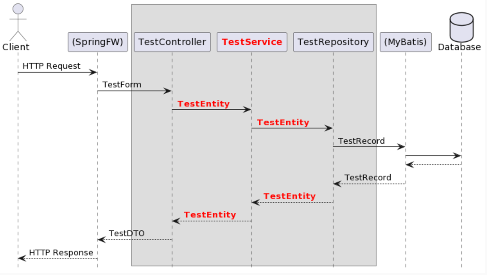

# Spring

spring 3層アーキテクチャサンプル

## リンク
- [講義スライド](https://docs.google.com/presentation/d/1XxuradOMHlYtmeOe0fUyorE3yYfDHAvJmjZf__lqzEA/edit?usp=sharing)
  - 講義全体の内容スライド
- [spring initializr](https://start.spring.io/)
  - ビルド管理ツールでのパッケージインストール確認
- [Documentation for the html2 Generator](https://openapi-generator.tech/docs/generators/html2/)
  - ドキュメン自動生成ツールドキュメント
- [Documentation for the spring Generator](https://openapi-generator.tech/docs/generators/spring/)
  - spring コード自動生成ツールドキュメント
- [OpenAPITools / openapi-generator - Generate multiple sources](https://github.com/OpenAPITools/openapi-generator/tree/master/modules/openapi-generator-gradle-plugin#generate-multiple-sources)
  - 自動生成書き方サンプル
